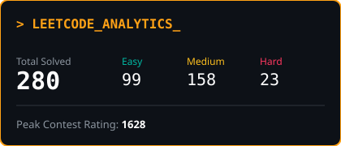
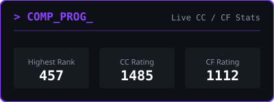
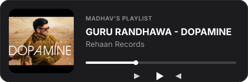

<div align="center">
  <p><small><i>ॐ नमः शिवाय</i></small></p>

  <a href="https://github.com/madhavkapila">
    
  </a>
  
  <p>
    <a href="https://linkedin.com/in/madhav-kapila"></a>
    <a href="https://leetcode.com/SmartKapila/"></a>
  </p>
</div>

---

### 🤖 MadhavGit.ai | System Terminal

```bash
$ madhav --status --verbose
> [INIT] Loading weights from local vector DB...
> [INFO] Booting Active Agent on Gemma 3 cluster...
> "Silent on GitHub, plotting empires quietly, but forever a soft-hearted gabru."
```

<div align="center">


<a href="https://github.com/madhavkapila/madhavkapila/issues/new?title=Query%20for%20Madhav&#39;s%20AI%20PA&body=Hey%20this%20side%20Madhav&#39;s%20AItwin%20,%0A%0A[Type%20your%20question%20about%20Madhav&#39;s%20tech%20stack,%20projects,%20or%20experience%20here.%20A%20dedicated%20AI%20Assistant%20will%20reply%20in%20under%205%20minutes.%0A]%0A">
  
</a>
<p><i>Click to open a query. My Digital Assistant will reply, close, and lock the thread instantly.</i></p>
</div>

---

### 💻 The Engineering Arsenal

<div align="center">

  <a href="https://skillicons.dev">
    
  </a>
  <br>
  <a href="https://skillicons.dev">
    
  </a>

  <br><br>

  
  
  
  
  
  
  
  
  
  
  

</div>

---

### 🚀 Production Ecosystem


* **ChatVat:** Universal RAG Chatbot CLI (Zero-dependency Docker)
* **MentorMatch:** AWS Distributed Matchmaker (Zero-downtime CI/CD)
* **Auto-Evaluator:** NLP Grading Pipeline (PyMuPDF & Sentence-Transformers)
* **Saturnalia SatBot:** Live Event Dynamic RAG (Resolved Reader/Writer Locks)
* **Food Rating Engine:** LLD Java REST API (O(1) HashMaps & O(logn) TreeSets)

<br clear="both">

---

### 🏆 Problem Solving

<table width="100%" border="0" cellpadding="0" cellspacing="0" style="background-color: transparent;">
  <tr>
    <td width="60%" align="left" valign="middle">
      <a href="https://leetcode.com/SmartKapila/">
        
      </a>
      <br>
      <a href="https://www.codechef.com/users/SmartK">
        
      </a>
    </td>
    <td width="50%" align="right" valign="middle">
      
    </td>
  </tr>
</table>

---

### 📊 Open Source Analytics & Impact

<div align="center">
  
</div>

<br>

<div align="center">
  
</div>

<br>

<div align="center">
  <table width="100%" border="0" cellpadding="0" cellspacing="0" style="background-color: transparent;">
    <tr>
      <td align="center" width="50%" valign="top">
        
      </td>
      <td align="center" width="50%" valign="top">
        
      </td>
    </tr>
    <tr>
      <td align="center" width="50%" valign="top">
        <br>
        
      </td>
      <td align="center" width="50%" valign="top">
        <br>
        <a href="https://music.youtube.com/playlist?list=PLiNce0QIvDSm00HL2FoOskaCFuNTEeR2v">
          
        </a>
      </td>
    </tr>
  </table>
</div>

<br>

<div align="center">
  
</div>

<br>

---

<div align="center">
  <h2><i>"God's plan, baby!"</i> — <b>VK18</b></h2>
</div>